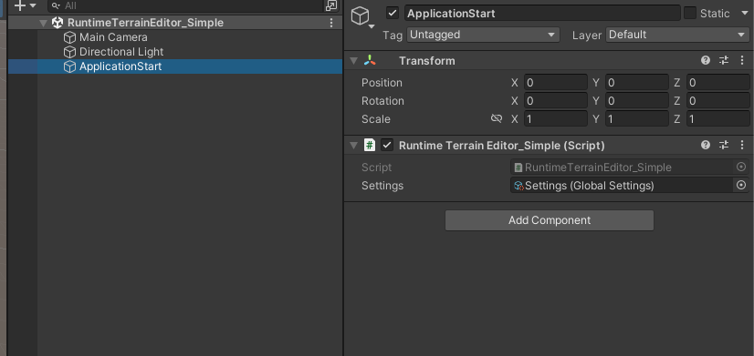
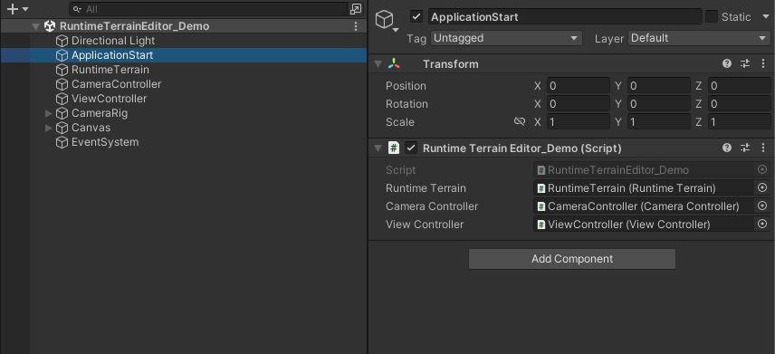
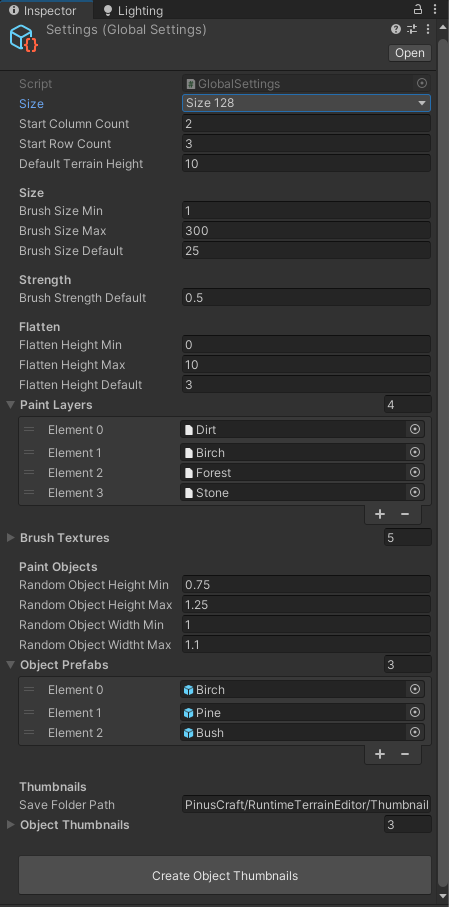
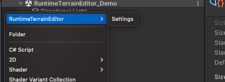
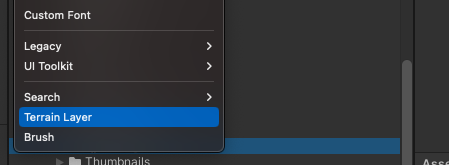
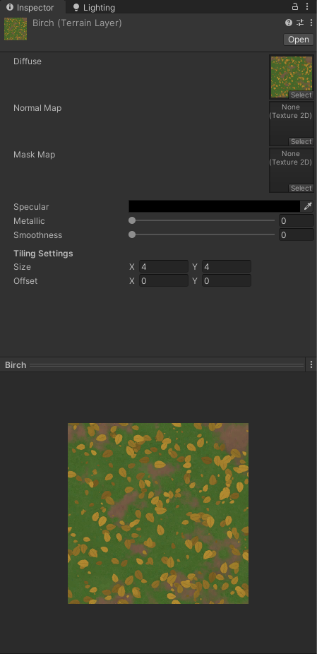

# RUNTIME TERRAIN EDITOR V2

Thank you for buying this asset!  
This documentation will explain the project structure and will walkthrough over how to modify and add custom content.  


## Getting Started
Unity Terrain is a rapid and powerful tool to create your project scene environment. But it's limited to Unity Editor itself. There is no official solution to use it in runtime/playmode. 

This package aims to utilize the [Unity Terrain API](https://docs.unity3d.com/ScriptReference/Terrain.html) and demonstrate how to make a runtime terrain editor to achive the idea of providing such tools in runtime. 

> This project uses Legacy Input and Legacy Unity UI components for the sake of simplicity.

## Simple Scene Breakdown

Open the `RuntimeTerrainEditor_Simple` from the `Scenes` folder.  


The simple scene is a programmatic example that demonstrates the basic features of the project.

Now if you play, you can raise heights with pointer.

Let's take a look into code.

```
//  Scripts/Examples/RuntimeTerrainEditor_Simple.cs
public class RuntimeTerrainEditor_Simple : MonoBehaviour
{
    //  contains terrain configurations
    public GlobalSettings settings; //  assigned from the scene

    private RuntimeTerrain _rt;

    private void Start()
    {
        //  add component
        _rt = gameObject.AddComponent<RuntimeTerrain>();    //  1
        
        //  assign settings and initiliaze
        _rt.settings = settings;                            //  2
        _rt.Init(Camera.main);

        //  configure brush
        _rt.SetMode(BrushMode.RAISE);                       //  3
        _rt.SetBrushSize(40);                               
        _rt.SetBrushStrength(Constants.MAX_BRUSH_STRENGTH);

        //  terrain created callback
        _rt.OnTerrainCreated += OnCreated;                  //  4

        //  create a grid of terrain by size  
        _rt.SetTerrainSize((int)TerrainSize.Size128);

        //  create a 4x4 grid (total 512 x 512)
        _rt.CreateGrid(4, 4);                               //  5
        
        //  or create a single terrain 512 x 512
        // _rt.SetTerrainSize((int)TerrainSize.Size512);
        // _rt.CreateTerrain(0,0);                          //  6
    }

    private void OnCreated(Terrain terrain)
    {
        terrain.name = "Terrain " + _rt.Terrains.Count;
    }

    private void FixedUpdate()
    {
        //  left mouse click
        if (Input.GetMouseButton(0))
        {
            //  stroke brush
            _rt.UseBrushAtPointerPosition();                //  7
            
            //  or provide which terrain to modify 
            //  and the modify position(as world position)
            // _rt.UseBrush(someTerrain, somePosition);     //  8
        }
    }
}
```

1. Add `RuntimeTerrain` to the gameObject.
2. Set settings and initiliaze. Component will use settings file values to initialize the defaults.

> Without settings object `RuntimeTerrain` will raise an exception.

3. Set modify mode, change brush size and strength.
4. Set a callback to notified when a terrain created. 
5. Create a grid of terrain.
6. Alternative to `CreateGrid` method. Create terrain patches manually.
7. Use brush with current mode and properties by `Input.mousePosition` and raycast. 
8. Alternatively handle modifying manually. You might need to use it other than pointer position. 

> Note that position must be world position, internally it'll check brush size and will modify neigbors if needed. 


## Demo Scene Breakdown
Open the `RuntimeTerrainEditor_DemoScene` from the `Scenes` folder.  

Let's take a look into the scene hierarchy.  
 

### ApplicationStart
Demo entry point. Initializes the controllers and `RuntimeTerrain`.

Let's follow the code and scene setup.
```
//  Scripts/Examples/RuntimeTerrainEditor_Demo.cs
public class RuntimeTerrainEditor_Demo : MonoBehaviour
{
    //  scene referecences 
    public RuntimeTerrain runtimeTerrain;
    public CameraController cameraController;
    public ViewController viewController;

    private InputController _inputController;

    private void Start()
    {
        Application.targetFrameRate = 60;

        runtimeTerrain.Init(Camera.main);                           //  1
        cameraController.Init(Camera.main);
        viewController.Init(runtimeTerrain);
        _inputController = new InputController(runtimeTerrain);
        
        runtimeTerrain.OnTerrainCreated += OnTerrainCreated;        //  2
        
        int startColumn = runtimeTerrain.settings.startColumnCount; 
        int startRow    = runtimeTerrain.settings.startRowCount;
        int startSize   = (int)runtimeTerrain.settings.size;

        runtimeTerrain.CreateGrid(startColumn, startRow, startSize);//  3
    }

    private void OnTerrainCreated(Terrain terrain)
    {
        //  set terrain custom properties here
        //  name, material, etc.
        terrain.name = "Terrain_" + runtimeTerrain.Terrains.Count;
    }

    private void FixedUpdate()
    {
        //  check if player is interacting 
        //  with a ui object(input field etc.)
        if (EventSystem.current.currentSelectedGameObject != null)
        {
            return;
        }

        _inputController.ListenInputs();                            //  4
    }

    private void LateUpdate()
    {
        cameraController.ListenInputs();                            //  5
    }
}
```

1. Initiliaze controllers.
2. Set a callback to get notified when a terrain created.
3. Get size values from settings and generate a grid of terrain.
4. Listen modify inputs.
5. Listen camera inputs.

Fundamentaly, this scene follows the same flow as simple scene. But in this scene,
- `CameraController` handles camera movement.
- `InputController` listens inputs and registering undo-redo stack by `CommandHistory`.
- `ViewController` handles ui inputs, populates ui values by settings and applies ui inputs to `RuntimeTerrain`.

## Settings
  

Settings is an asset available as ScriptableObject to provide editing functionality. `ViewController` and `RuntimeTerrain` initializes the settings values.

It is also possible to create multiple settings asset in your project. You can create a new settings asset from create menu shown below:  



### Paint Layers
This project uses standart Unity Terrain Layers for paint. This list will be appear in view by order.  

To create a new layer, open Create menu in project panel and click Terrain Layer like shown below:



Here is an example terrain layer shown below at `Terrain/Layers/Birch`



### Brush Textures
`RuntimeTerrain` will read grayscale information from the source texture. This list will be appear in view by order.  
 
Any texture resolution could be used since active brush texture will be scaled down or up by current brush size. 

### Object Prefabs
This project uses [TreePrototype](https://docs.unity3d.com/ScriptReference/TreePrototype.html) to register prefabs to Terrain and [TreeInstance](https://docs.unity3d.com/ScriptReference/TreeInstance.html) to place on terrain.  

You can add your custom prefabs to use in editor.  

Note that Unity Terrain requires LOD setup to place any GameObject. This prefabs will appear in `ToolView` in order of this list.  

### Object Thumbnails
Thumbnail textures will be used by prefab index. If no index found, it will appear white color.

To create thumbnails, you can use `Create Object Thumbnails` button. Generated textures will be saved to path provided at settings(`Save Folder Path` field), afterwards they'll be initialized to this list.

## Save and Load

Default save file extension is ".RUNTIMEMAP".  
Default save file directory is [`Application.persistentDataPath`](https://docs.unity3d.com/ScriptReference/Application-persistentDataPath.html)

See `Constants.cs` file to modify default values.

### Serialization

`Serialization` is a static class which can serialize and deserialize any object.  
Check for more information [`BinaryFormatter`](https://docs.microsoft.com/en-us/dotnet/api/system.runtime.serialization.formatters.binary.binaryformatter?view=netstandard-2.1). 

Here is a simple example: 

```
class MyClass
{
    public int someValue;
    public string[] someOtherValues;
}


var example = new MyClass()
{
    someValue = 22,
    someOtherValues = new string[] { "any", "info", "here"}
}

bytes[] bytes = Serialization.Serialize<MyClass>(example);

...

Myclass result = Serilalization.Deserialize<MyClass>(bytes);
```

> `Serialize` method uses compression to lower the result file size. For more info [`GZipStream`](https://docs.microsoft.com/en-us/dotnet/api/system.io.compression.gzipstream?view=net-6.0).

Maps with size lower than 1024 will likely result a file size below 1MB.

### FileUtility

This class provides helper methods to read, write and delete files. Example below shows the save, load and delete process of a map.

```
//  ViewController.cs
private void OnSave()
{
    var path = GetSavePath(savePanelView.nameField.text);
    var data = _runtimeTerrain.Export();
    var bytes = Serialization.SerializeCompressed<TerrainFileData>(data);
    
    FileUtility.SaveToPath(path, bytes);

    ReloadMapFiles();
}

private void OnLoad(FileInfo info)
{
    var bytes = FileUtility.LoadFromPath(info.FullName);
    var map = Serialization.DeserializeCompressed<TerrainFileData>(bytes);
    
    _runtimeTerrain.Import(map);
    CheckAndDisplaySize(map.mapSize);
}

private void OnDelete(FileInfo info)
{
    FileUtility.DeleteFileAtPath(info.FullName);
    
    ReloadMapFiles();
}
```